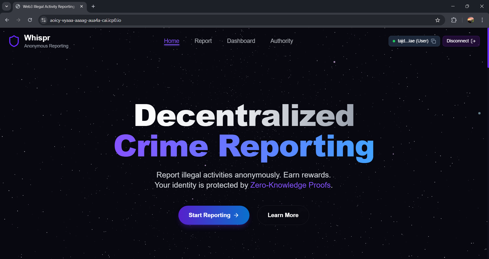
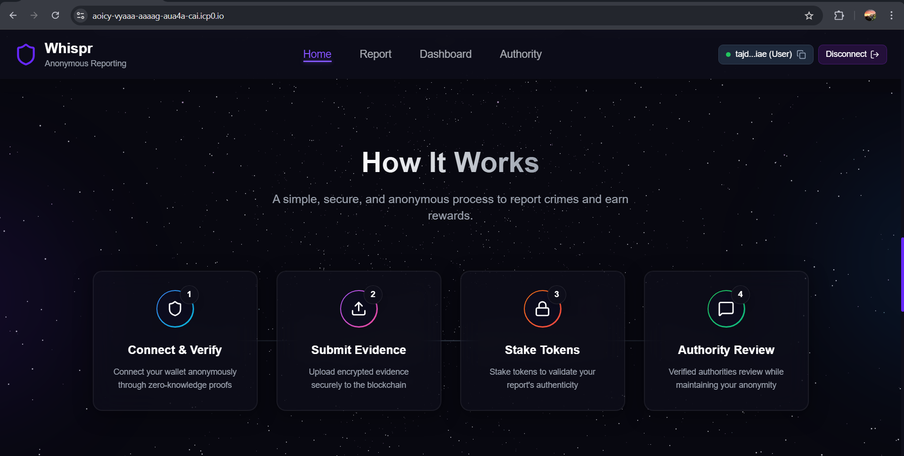
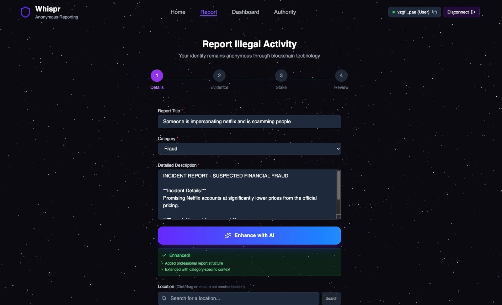
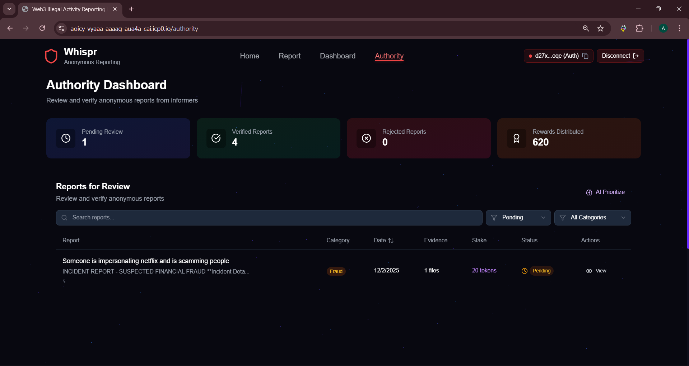
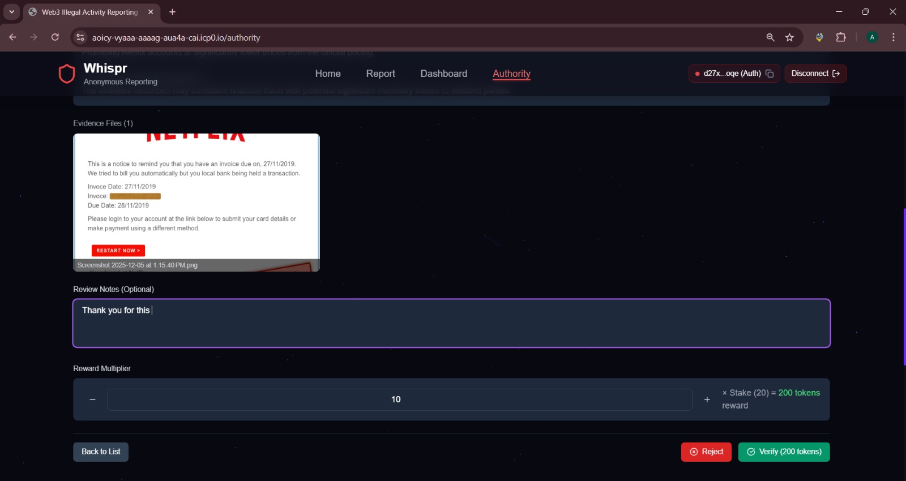

# Whispr

**Decentralized Anonymous Crime Reporting Platform**

Whispr is a blockchain-powered platform for anonymous crime reporting built on the Internet Computer Protocol (ICP). It enables citizens to securely report crimes while maintaining complete anonymity through cryptographic identity protection.

---

## Table of Contents

1. [Overview](#overview)
2. [Architecture](#architecture)
3. [Features](#features)
4. [Technology Stack](#technology-stack)
5. [IPFS Integration](#ipfs-integration)
6. [Getting Started](#getting-started)
7. [Testing](#testing)
8. [Deployment](#deployment)
9. [Screenshots](#screenshots)
10. [Contributing](#contributing)

---

## Overview

Traditional crime reporting systems often fail to protect informer identities, creating fear of retaliation and discouraging citizens from reporting criminal activities. Whispr addresses this critical challenge by leveraging blockchain technology to create a trustless, anonymous reporting environment.

The platform generates cryptographic identities that cannot be traced back to users, stores all data on decentralized infrastructure, implements a token staking mechanism to ensure report authenticity, and provides rewards for verified reports.

### The Problem

In conventional systems, when a citizen submits a report, their identity is stored in a centralized database controlled by authorities. This creates a direct link between the informer and their report, exposing them to potential retaliation from criminal elements.

### The Solution

Whispr eliminates this vulnerability by generating an Ed25519 cryptographic identity for each user session. Reports are submitted through this anonymous identity and stored immutably on the Internet Computer blockchain. Authorities can access and verify reports without ever knowing the true identity of the informer.

```
+-------------------------------------------------------------------------+
|                        Whispr Architecture                               |
+-------------------------------------------------------------------------+
|  [Citizen] ---> [Crypto Identity] ---> [ICP Blockchain] <--- [Authority]|
|      |              |                        |                    |      |
|      |              v                        v                    |      |
|      |        Anonymous ID           Immutable Record             |      |
|      |              |                        |                    |      |
|      +--------------+------------------------+--------------------+      |
|                            |                                             |
|                            v                                             |
|                   Identity Protected                                     |
+-------------------------------------------------------------------------+
```

---

## Architecture

```
+----------------------------------------------------------------------------+
|                              WHISPR SYSTEM                                  |
+----------------------------------------------------------------------------+
|                                                                            |
|   +------------------+         +------------------+                        |
|   |   FRONTEND       |         |   BACKEND        |                        |
|   |   (React)        |<------->|   (Rust)         |                        |
|   |                  |  HTTP   |                  |                        |
|   |  - User Portal   |  Agent  |  - Report Store  |                        |
|   |  - Authority     |         |  - Auth Logic    |                        |
|   |    Dashboard     |         |  - Token System  |                        |
|   |  - Report Form   |         |  - Evidence Mgmt |                        |
|   +------------------+         +------------------+                        |
|           |                            |                                   |
|           v                            v                                   |
|   +------------------------------------------------------------------+    |
|   |              INTERNET COMPUTER BLOCKCHAIN                         |    |
|   |                                                                   |    |
|   |   +-------------+  +-------------+  +-------------+              |    |
|   |   |  Frontend   |  |  Backend    |  |  Stable     |              |    |
|   |   |  Canister   |  |  Canister   |  |  Memory     |              |    |
|   |   +-------------+  +-------------+  +-------------+              |    |
|   +------------------------------------------------------------------+    |
+----------------------------------------------------------------------------+
```

### Report Submission Flow

When a user creates a report, the frontend first generates an Ed25519 cryptographic identity unique to their browser session. The user then stakes tokens as a commitment to the report's authenticity. The report is submitted to the backend canister through the Candid interface, where it is stored in stable memory and simultaneously pinned to IPFS via Pinata. The backend returns a unique report ID, and the user receives confirmation of successful submission.

### Authority Verification Flow

Authorities access the system by connecting their Plug wallet, which provides their ICP principal for authentication. The backend verifies that the principal belongs to a registered authority before granting access to the dashboard. From there, authorities can review reports, verify or reject them, and communicate anonymously with informers. When a report is verified, the staked tokens are multiplied and distributed back to the informer as a reward.

### Token Reward System

The token staking mechanism serves dual purposes: it discourages false reports by requiring users to put tokens at risk, and it rewards genuine informers when their reports are verified. Users stake X tokens when submitting a report. If the report is verified by authorities, the user receives X multiplied by 10 tokens as a reward. If the report is rejected as fraudulent, the staked tokens are forfeited. Reports pending review maintain their staked tokens until a decision is made.

---

## Features

### For Informers

Whispr provides informers with comprehensive tools for anonymous crime reporting. Each browser session generates a unique Ed25519 cryptographic identity that cannot be traced back to the user. The platform supports over 15 crime categories including fraud, violence, corruption, cybercrime, and more. Users can attach images, videos, and documents as evidence, all of which are encrypted before storage. The token staking system ensures report authenticity while providing the opportunity to earn up to 10x the staked amount for verified reports. A personal dashboard allows users to track the status of their submitted reports in real-time.

### For Authorities

The authority dashboard provides secure access through Plug wallet authentication with principal verification. Authorities can view, filter, and sort all submitted reports by category, status, date, or other criteria. Verification tools allow them to approve reports as verified, reject false reports, or mark reports for further review. An anonymous messaging system enables communication with informers without exposing identities. Bulk operations support processing multiple reports simultaneously, and real-time statistics provide analytics on report processing and verification rates.

### Security

All data is stored on ICP stable memory, providing blockchain-level security and immutability. Reports and evidence are additionally pinned to IPFS via Pinata for decentralized backup. Principal-based authentication eliminates the need for personal data collection. Role-based access control strictly separates user and authority functions. All evidence and report logs are tamper-proof and permanently recorded on the blockchain.

---

## Technology Stack

### Frontend

The frontend is built with **React 18** as the UI framework, using **Vite** for fast development builds and hot module replacement. Styling is handled through **Tailwind CSS** for utility-first responsive design. Communication with the ICP blockchain is managed through **@dfinity/agent**, while **@dfinity/identity** handles cryptographic identity generation and management. **Framer Motion** provides smooth animations throughout the interface. The test suite is built on **Jest** with React Testing Library.

### Backend

The backend canister is written in **Rust** for performance and safety guarantees. **ic-cdk** provides the Internet Computer SDK for canister development. Persistent storage uses **ic-stable-structures** with StableBTreeMap for data that survives upgrades. The **Candid** interface definition language enables type-safe communication between frontend and backend. **Serde** handles serialization and deserialization of data structures for both storage and IPFS integration.

## IPFS Integration

Whispr uses IPFS via Pinata for decentralized, immutable storage of reports and evidence. This provides an additional layer of data permanence beyond the ICP blockchain.

When a report is submitted, it is first stored in the canister's stable memory. The backend then creates a JSON snapshot of the report containing the report ID, title, description, category, stake amount, evidence count, location, incident date, status, submission timestamp, and a SHA-256 hash of the submitter's principal (protecting their identity while maintaining accountability). This snapshot is pinned to IPFS through Pinata's API, which returns a Content Identifier (CID). The CID is stored alongside the report record for future retrieval.

Evidence files follow a similar process. Each file is base64-encoded and wrapped in a JSON structure containing the report ID, file name, file type, upload timestamp, and the encoded data. This is pinned separately to IPFS, with the resulting CID stored in the evidence record.

Only authorities can retrieve data from IPFS through the backend canister. This ensures that even though the data is stored on a public network, access is controlled and auditable.

---

## Getting Started

### Prerequisites

Before starting, ensure you have **Node.js** version 18.x or higher, **DFX SDK** version 0.15.x or higher, and **Rust** version 1.70 or higher installed on your system.

### Installation

Clone the repository and navigate to the project directory:

```bash
git clone https://github.com/AR21SM/Whispr.git
cd Whispr
```

Install the frontend dependencies:

```bash
cd src/Whispr_frontend
npm install
cd ../..
```

### Local Development

Start the local ICP replica in the background:

```bash
dfx start --background
```

Deploy the canisters to the local replica:

```bash
dfx deploy
```

Start the frontend development server:

```bash
cd src/Whispr_frontend
npm run start
```

Access the application at `http://localhost:3000`. The Candid UI for direct backend interaction is available at `http://localhost:4943`.

---

## Testing

The project uses Jest with React Testing Library for comprehensive frontend testing.

### Running Tests

Navigate to the frontend directory and run the test suite:

```bash
cd src/Whispr_frontend
npm test
```

Additional test commands are available: `npm run test:watch` runs tests in watch mode for development, `npm run test:coverage` generates a coverage report, and `npm run test:verbose` provides detailed test output.

### Test Coverage

The test suite includes **118 tests** across 5 modules. The **utils/helpers** module contains 32 tests covering date formatting, text truncation, validation, and debounce utilities. The **utils/storage** module has 19 tests for LocalStorage operations and report storage functions. The **constants** module includes 23 tests for report categories, statuses, and configuration values. The **services/reportService** module contains 18 tests for report submission, fetching, and filtering logic. The **hooks/useFilters** module has 26 tests for data filtering, sorting, and search functionality. All tests are currently passing.

---

## Deployment

### Deploy to IC Mainnet

Set your dfx identity and deploy to the mainnet:

```bash
dfx identity use <your-identity>
dfx deploy --network ic
```

### Canister Management

Check the status of deployed canisters:

```bash
dfx canister status Whispr_backend --network ic
dfx canister status Whispr_frontend --network ic
```

Upgrade canisters with new code:

```bash
dfx deploy Whispr_backend --network ic
dfx deploy Whispr_frontend --network ic
```

---

## Screenshots

### Home Page



### Report Submission



### Token Staking


### User Dashboard


### Authority Dashboard



---

## Contributing

Contributions are welcome. To contribute, fork the repository, create a feature branch (`git checkout -b feature/improvement`), commit your changes (`git commit -am 'Add new feature'`), push to the branch (`git push origin feature/improvement`), and open a Pull Request. Please ensure all tests pass before submitting.

---
